# Crypto Assistant Bot

[](https://www.python.org/downloads/release/python-31016/)
[](https://opensource.org/licenses/MIT)

---

## Описание проекта

Crypto Assistant Bot – это Telegram-бот, предназначенный для учета покупок криптовалют и расчета средней цены покупки.
Бот поддерживает ограниченный список криптовалют, каждая из которых идентифицируется уникальным тикером.
Пользователи могут добавлять покупки, просматривать среднюю цену, удалять конкретные покупки, очищать
данные и экспортировать их в CSV-файл.

> [Техническое задание](./TASKS.md)

---

## Стек технологий

- [x] Python 3.10
- [x] aiogram 3.19
- [x] Telegram Bot API 8.3

---

## Как запустить проект локально

1. **Клонируйте репозиторий:**

   ```bash
   git clone https://github.com/yuldashov10/crypto_assistant_bot.git
   cd crypto_assistant_bot
   ```

2. **Создайте и активируйте виртуальное окружение:**

   ```bash
   python -m venv .venv
   source .venv/bin/activate       # Linux/MacOS
   call .venv\Scripts\activate     # Windows
   source .venv/Scripts/activate   # Windows (Git Bash) 
   ```

3. **Установите зависимости:**

   ```bash
   pip install -r requirements.txt
   ```

4. **Настройте файл окружения:**

    - Скопируйте `.env.sample` в `.env` и заполните переменные.

5. **Запустите бота:**
   ```bash
   python main.py
   ```

### Кастомизация запуска бота:

Вы можете выбрать тип хранилища для данных о покупках, передав параметр `--storage` (или `-s`) при запуске бота.
Доступны следующие варианты:

- `memory` – Данные будут храниться в памяти бота, и при его отключении все данные удалятся.
- `sqlite` – Данные сохраняются в базе данных SQLite (по умолчанию `cab.db`).
- `json` – Данные сохраняются в формате JSON в файл `cab.json`.

Примеры запуска с разными типами хранилищ:

  ```bash
  python main.py -s memory
  python main.py -s sqlite
  python main.py -s json
  ```

---

## Примеры работы

* **Начало работы**

  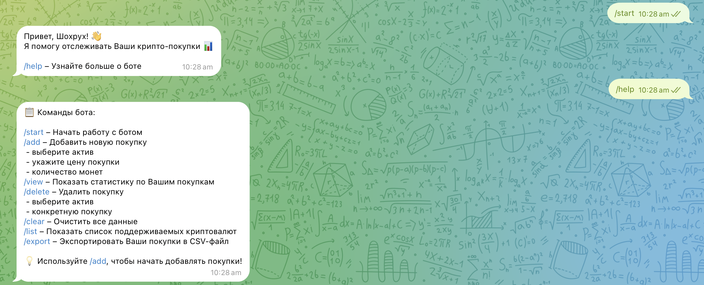

  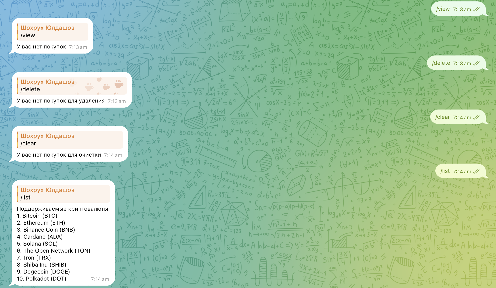

  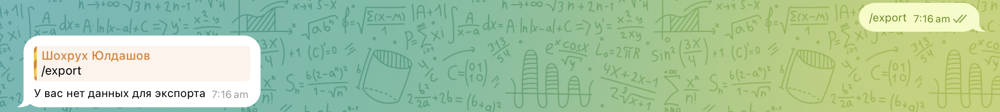

* **Добавление покупки**

  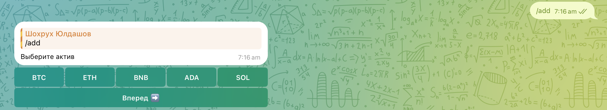

  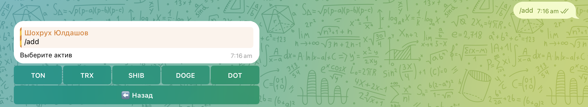

  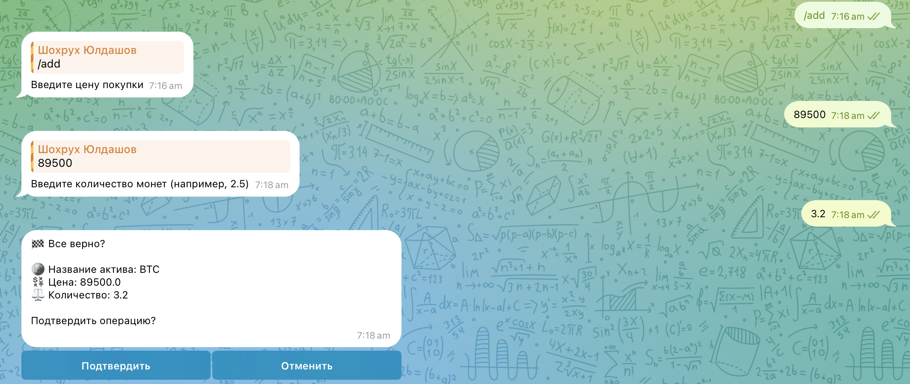

  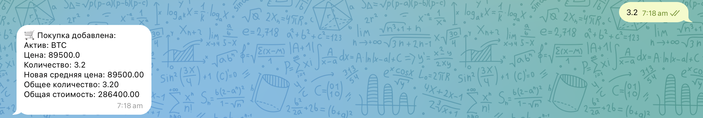

* **Удаление** **покупки**

  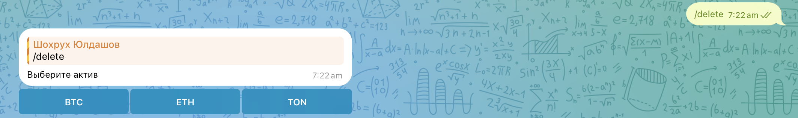

  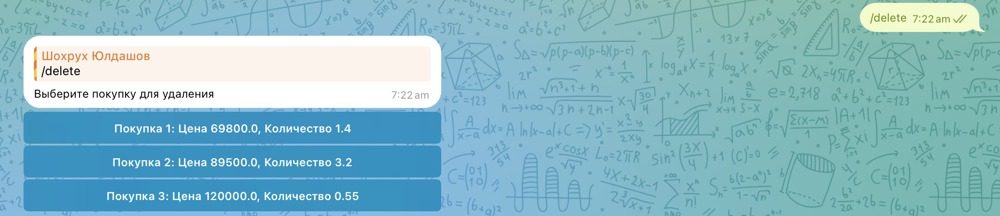

  

  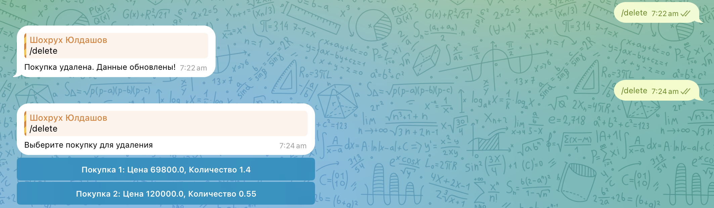

* **Очистка данных**

  

  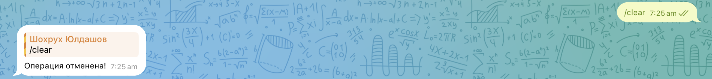

* **Просмотр данных**

  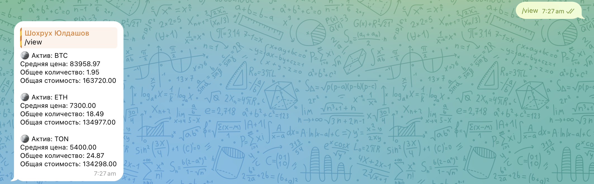
* **Экспорт данных**

  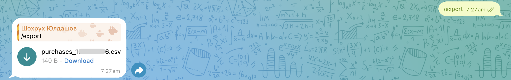

  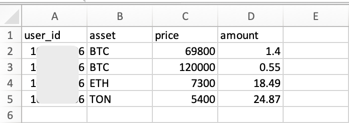

---

## Автор

- Шохрух Юлдашов | [Telegram](https://t.me/shyuldashov/)

---
